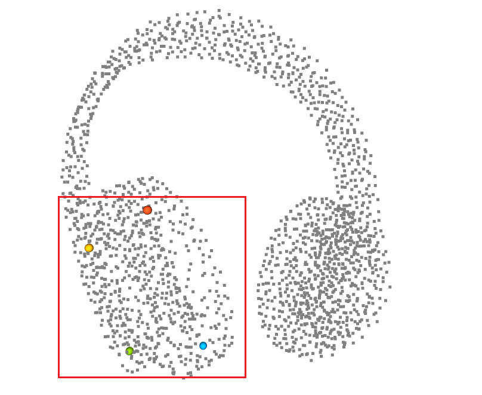
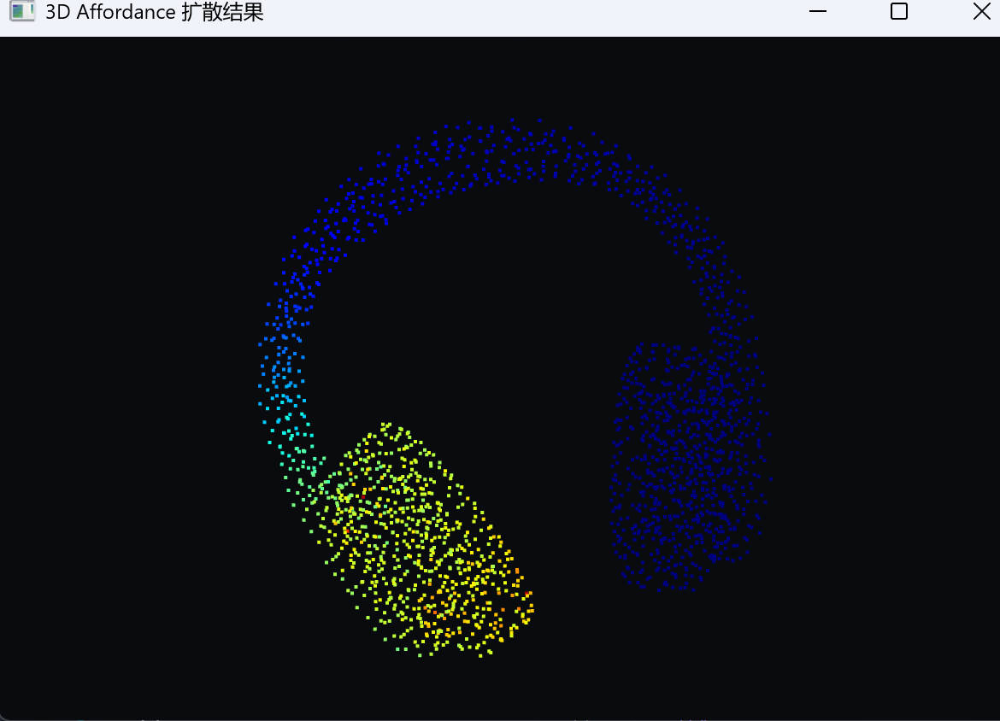
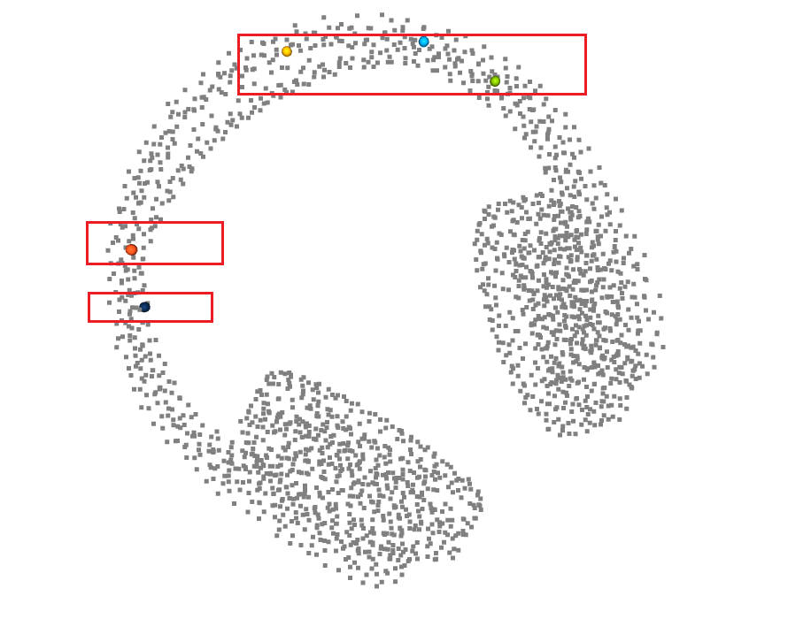
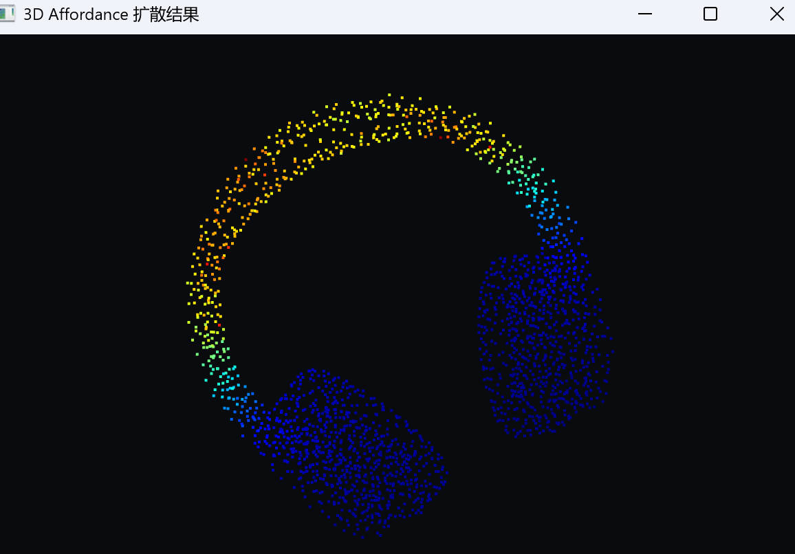
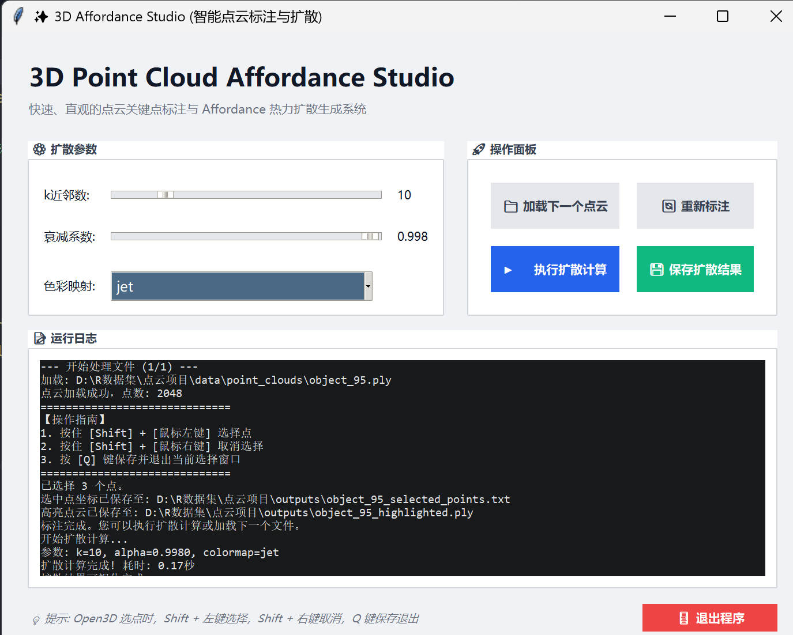

<h1 align="center">Point Cloud Affordance Annotator</h1>

<p align="center">
  <b>Click a few 3D points. Diffuse them into a dense affordance heatmap.</b>
</p>

<p align="center">
  
  
  
</p>

<p align="center">
  <a href="#-visual-gallery">Visual Gallery</a> ·
  <a href="#-installation">Installation</a> ·
  <a href="#-run-the-demo">Run Demo</a> ·
  <a href="#-gui-guide">GUI Guide</a> ·
  <a href="#-project-map">Project Map</a>
</p>

---

## ✨ Capabilities

| Capability | Result |
| --- | --- |
| 🎯 Sparse clicks | Select only a few seed points |
| 🌈 Dense heatmap | Diffuse scores to every point |
| ⚡ Fast feedback | Re-run with different `k`, `alpha`, or colormap |
| 🧰 Clean workflow | Inputs in `data/point_clouds/`, outputs in `outputs/` |
| 🧩 Easy reading | Core logic split into small modules |

> Built for quick dataset labeling, robotics affordance experiments, and visual sanity-checking of point-cloud interaction regions.

## 🖼 Visual Gallery

### Local Interaction Region

Few clicks on a local region become a smooth affordance field.

| 🎯 Sparse seeds | 🌈 Diffused heatmap |
| --- | --- |
|  |  |

### Ring / Handle Region

Sparse seeds on the handle-like region expand into a clear interaction heatmap.

| 🎯 Sparse seeds | 🌈 Diffused heatmap |
| --- | --- |
|  |  |

## 🚀 Installation

### 1. Clone

```bash
git clone https://github.com/Sihang-Geng/Point-Cloud-Affordance-Annotator.git
cd Point-Cloud-Affordance-Annotator
```

### 2. Create the conda environment

```bash
conda create -n pc-affordance python=3.9 -y
conda activate pc-affordance
```

### 3. Install dependencies

```bash
pip install -r requirements.txt
```

Optional mirror:

```bash
pip install -r requirements.txt -i https://pypi.tuna.tsinghua.edu.cn/simple
```

## ⚡ Run the Demo

Run the prepared sample:

```bash
python test.py
```

| 🎯 Pick seeds | ✅ Press `Q` | 🌈 Diffuse | 💾 Save |
| --- | --- | --- | --- |
| choose sparse points | return to GUI | generate heatmap | write results |

Then:

| Step | What to do | What happens |
| --- | --- | --- |
| 1 | `Shift + left click` points | choose sparse seeds |
| 2 | Press `Q` | return to the GUI |
| 3 | Click `执行扩散计算` | see the heatmap |
| 4 | Click `保存扩散结果` | write results to `outputs/` |

Use your own `.ply`:

```text
data/point_clouds/
```

Edit the top of `test.py`:

```python
TEST_POINT_CLOUD_FILE = r"data\point_clouds\your_file.ply"
OUTPUT_DIR = "outputs"
```

Run again:

```bash
python test.py
```

## 🧭 GUI Guide

<p align="center">
  
</p>

| Control | Purpose |
| --- | --- |
| 📂 `加载并标注下一个点云` | Load a point cloud and open the picking window |
| 🔁 `重新标注当前点云` | Re-pick seed points for the current cloud |
| 🔎 `k近邻数` | Control the local graph neighborhood |
| 🌊 `衰减系数` | Control diffusion strength |
| 🎨 `色彩映射` | Switch visual colormap |
| 🌈 `执行扩散计算` | Generate the affordance heatmap |
| 💾 `保存扩散结果` | Save the colored `.ply` result |

Open3D picking:

| Gesture | Action |
| --- | --- |
| `Shift + left click` | Select a seed point |
| `Shift + right click` | Remove a selected point |
| `Q` | Finish picking |

## 📦 Outputs

Generated files are written to `outputs/` by default.

```text
Pick seeds → Press Q → Run diffusion → Save result
```

| File | Description |
| --- | --- |
| `*_selected_points.txt` | Selected seed point indices and XYZ coordinates |
| `*_highlighted.ply` | Point cloud with selected seeds highlighted |
| `*_affordance.ply` | Colored point cloud with an extra `affordance` score field |

The affordance PLY stores:

```text
x, y, z, red, green, blue, affordance
```

## 🧪 Batch Annotation

For dataset-style labeling, edit `main.py`:

```python
RUN_MODE = "batch"
BATCH_DATA_DIR = r"d:\Latex工作区\666\knife"
BATCH_START_FOLDER = 117
OUTPUT_DIR = "outputs"
```

Then run:

```bash
python main.py
```

Batch mode keeps the original prototype rule:

| Rule | Detail |
| --- | --- |
| Search root | `BATCH_DATA_DIR` |
| Valid folder | path contains `point_sample` |
| Valid file | file name is `ply-10000.ply` |
| Ordering | numeric parent folder |
| Resume point | `BATCH_START_FOLDER` |

## 🧠 How Diffusion Works

The implementation keeps the original behavior:

```text
selected seed points -> kNN graph -> normalized graph -> linear solve -> [0, 1] score
```

The core equation is:

```text
(I - alpha * W_tilde) S = Y
```

Code location:

```text
pc_affordance_annotator/diffusion.py
```

## 🗂 Project Map

```text
.
├── data/point_clouds/          # sample or user-provided input point clouds
├── examples/readme/            # README images with GitHub-safe names
├── legacy/                     # original single-file prototype
├── outputs/                    # generated annotation and diffusion files
├── pc_affordance_annotator/
│   ├── app.py                  # Tkinter GUI
│   ├── diffusion.py            # graph diffusion logic
│   ├── io_utils.py             # PLY/TXT helpers
│   ├── launcher.py             # launch helpers
│   ├── selection.py            # Open3D point picking
│   └── visualization.py        # heatmap rendering
├── main.py                     # configurable batch/single entry
├── test.py                     # easiest demo entry
└── requirements.txt
```

## ✅ Notes

| Topic | Note |
| --- | --- |
| Input format | PLY with `x`, `y`, `z` vertex fields |
| No colors? | The tool paints the cloud gray for picking |
| Visualization | Diffusion uses a dark Open3D background for stronger contrast |
| Git hygiene | Generated output files are ignored by default |

## 📄 License

MIT License. See [LICENSE](LICENSE).
